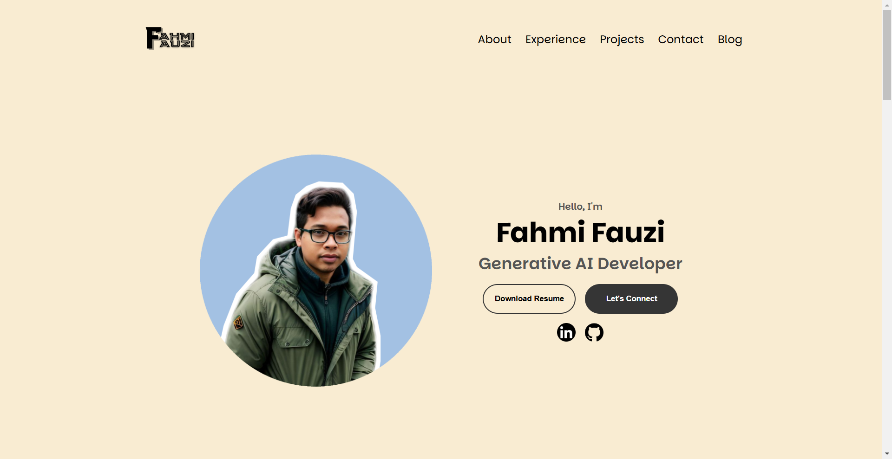

# Personal Portfolio Website

A modern, responsive portfolio website built with HTML, CSS, and JavaScript to showcase my experience as a Generative AI Developer, projects, and professional background.

  

## 🌟 Features

### Current Features
- **Responsive Design**: Fully responsive layout that works seamlessly on desktop and mobile devices
- **Navigation**:
  - Desktop navigation with smooth scrolling
  - Mobile-friendly hamburger menu
  - Section quick-navigation arrows
- **Sections**:
  - Profile/Hero section with social links
  - About Me with experience and education highlights
  - Detailed Experience section showcasing:
    - AI/ML Core competencies
    - Development skills
    - Infrastructure expertise
  - Projects portfolio with live demos and GitHub links
  - Contact information
- **Interactive Elements**:
  - Smooth scrolling navigation
  - Hover effects on buttons and links
  - Animated hamburger menu
  - Social media integration

### Planned Features
- Blog section for sharing insights and experiences
- Generative AI features integration
- Interactive chatbot assistance

## 🛠️ Technical Stack

- HTML5
- CSS3 (with custom responsive design)
- Vanilla JavaScript
- Google Fonts (Parkinsans)
- Custom icons and assets

## 🎨 Customization

### Colors
The website uses a minimalist color scheme:
- Primary text: Black (`#000000`)
- Secondary text: RGB(85, 85, 85)
- Borders: RGB(163, 163, 163)
- Backgrounds: White and RGB(250, 250, 250)

### Typography
- Main font: "Parkinsans" from Google Fonts
- Various font weights and sizes for different sections

## 📱 Responsive Breakpoints

- Desktop: 1400px and above
- Tablet: 1200px and below
- Mobile: 600px and below

## 🔧 Browser Support

The website is compatible with:
- Chrome (latest)
- Firefox (latest)
- Safari (latest)
- Edge (latest)

## 📞 Contact

Fahmi Fauzi - [fahmifauzi109@gmail.com](mailto:fahmifauzi109@gmail.com)

LinkedIn: [Fahmi Fauzi](https://www.linkedin.com/in/wan-fahmifauzi/)

Live Website: [https://fahmifauzi.my](https://fahmifauzi.my)

## 🚀 Deployment

This website is deployed on Netlify with a custom domain. 

### Deployment Details
- Platform: Netlify
- Domain: [fahmifauzi.my](https://fahmifauzi.my)
- Build Settings: Auto-deploy from main branch